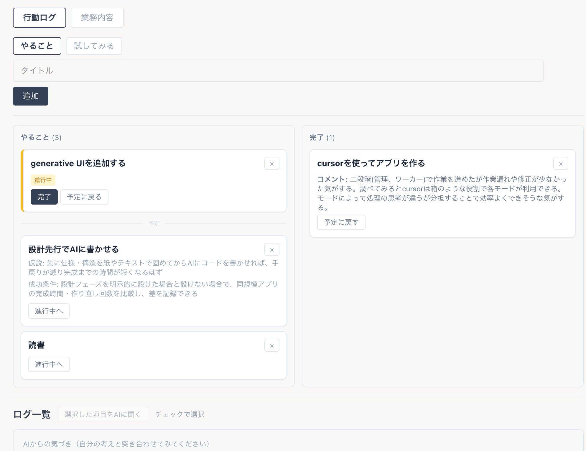
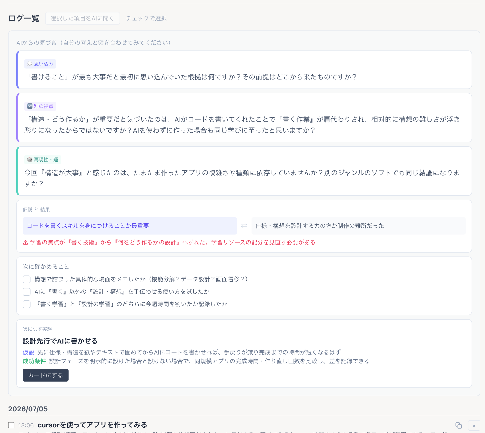

# learning-log

## 概要

これは、タスクに仮説と成功条件を設定して実行し、完了時の気づきをAIが分析する学習ログアプリです。
「実行→振り返り→AIの問い→次の実験をカード化→再び実行」のループで学習を回します。
AIは今のタスクに答えを出すのではなく問いを返し、そのうえで次に試す実験を仮説と成功条件つきで提案します。
最初から仮説を立てられなくても、完了したタスクの記録から次の仮説を見つけられる設計です。

## 制作背景

学習中に同じことを何度も調べ直していたため、記録用のメモ機能を持つシンプルなタスク管理アプリを作りました。
AIを使うようになってからは、調べるよりもAIに壁打ちして深掘りする学習に変わりました。
仮説を立てて検証するサイクルが理解を深めると気づき、日常の小さな仕事や学習にも持ち込めるよう、タスクに仮説と成功条件を持たせる形にしました。
また、AIの答えをもらうだけでは自分で考えない癖がつくと感じたため、AIは答えではなく問いを返す設計にしました。

## 機能

- 予定・実行中・完了したタスクが視覚的にわかりやすく管理できます。
- タスクは『やること』（タイトルのみで気軽に追加）と『試してみる』（仮説・成功条件つき）の2モードで作成できます。
- タスク完了時に結果・学び・コメントを記録できます。
- 過去の完了したタスクからAIに分析依頼ができます（問い・仮説と結果の比較・次の実験など）。
- AIが分析して提案した次の実験を、ワンクリックで新しいタスクカードにできます。
  
  「提案された実験はワンクリックでボードのカードになります。上の『設計先行でAIに書かせる』カードがその例です」

- 業務の手順や注意事項をまとめる引き継ぎ書タブがあります。
- リロードやブラウザ再起動でもデータが消えず、保存データに異常があっても自動で修復して読み込みます。
- 完了列には当日分のみ表示され、ログ一覧では全件を日付別に確認できます。

## 使用技術

- React
- TypeScript
- Vite
- Tailwind CSS
- Claude API
- localStorage

## 今後の改善予定

- APIキーをサーバー側で扱うプロキシ構成に変更した上でデモ公開予定
- カードの編集機能
- 完了時入力（下書き）の永続化

## セットアップ

npm install
npm run dev

- AI分析機能を使う場合は、プロジェクト直下に .env.local を作成し
- VITE_ANTHROPIC_API_KEY=（自分のAPIキー） を記載してください。
